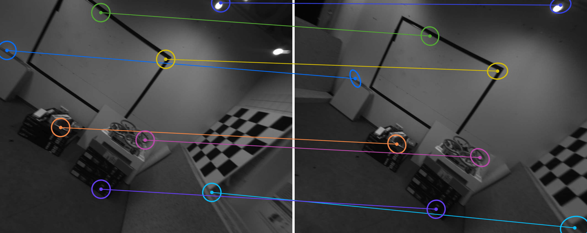

# Rolling Shutter Relative Pose Estimation Made Practical

Official implementation of **"Rolling Shutter Relative Pose Estimation Made Practical"**
(Daniel Barath, ETH Zürich / Google / HUN-REN SZTAKI).

<p align="center">
  
</p>

Rolling-shutter (RS) cameras are in nearly every phone, drone, and action cam,
yet RS-aware relative pose estimation has been *impractical*: the previous
state of the art needs **20+ point correspondences**, making RANSAC
prohibitively expensive. We make it practical by bringing **affine
correspondences (ACs)** into RS two-view geometry and deriving *RS-corrected
affine constraints*. The result is an algebraic solver that recovers the full
relative pose **and** the per-camera rolling-shutter motion from only
**7 affine correspondences** — small enough for efficient RANSAC.

- **7 ACs** instead of 20–44 point correspondences → drastically fewer RANSAC iterations.
- Solves the resulting **degree-20** polynomial system via action matrices in
  well under a millisecond per call.
- Uniquely recovers accurate **translational velocity** (the `v`–`t` coupling
  that point correspondences cannot resolve).
- Gracefully handles the **global-shutter** special case (zero readout time).

## Headline results (TUM Rolling-Shutter, RoMa features)

Pose AUC (higher is better) and median RS velocity errors `ε_ω`/`ε_v`
(lower is better; GS methods do not estimate RS motion).

| Method (stride 10) | AUC@5° | AUC@10° | AUC@20° | ε_ω | ε_v | time (s) |
|---|---|---|---|---|---|---|
| RS-20PC (Dai et al.) | 0.769 | 0.869 | 0.924 | 0.063 | 8.011 | 20.9 |
| RS-44PC (Dai et al.) | 0.870 | 0.929 | 0.960 | 0.050 | 9.537 | 46.3 |
| GS-5PC (Nistér)      | 0.861 | 0.908 | 0.934 | –     | –     | 5.3  |
| **Proposed (7-AC)**  | **0.897** | **0.948** | **0.973** | **0.043** | **0.051** | 7.5 |

Numbers are from the paper (single, consistent hardware). The proposed solver
is the most accurate in pose **and** the only RS solver with usable
translational-velocity estimates (baselines' `ε_v` ≈ 8–13). On the
global-shutter EuRoC MAV dataset it matches GS-5PC and correctly recovers
near-zero RS motion.

> **Runtime update.** The minimal solver has since been optimized (~0.2 ms per
> call). Re-timing the full pipeline for the Proposed method on an RTX 4090
> (all 10 TUM-RS sequences, stride 10, RoMa, `estimateRSEssentialMatrix7AC`)
> gives **≈1.0 s per image pair** (mean over 1000 pairs), down from the 7.5 s
> above. The baseline timings are the paper's original measurements and were
> not re-run on this hardware, so the table's runtime column is not a
> same-machine comparison.

## Repository layout

```
external/superansac/   SupeRANSAC robust-estimation library (git submodule)
rs_overlay/            the RS solver, layered onto SupeRANSAC at build time
  ├─ include/          RS estimator headers (+ small edits to base files)
  ├─ python/           RS pybind bindings
  ├─ tests/            TUM-RS / EuRoC loaders + real-data tester
  └─ apply_overlay.sh
benchmark/             C++ synthetic benchmark
examples/              runnable examples (synthetic + real data)
CMakeLists.txt         builds the SupeRANSAC core + benchmark
setup.sh               one-shot: submodule → overlay → build [→ pip install]
```

The RS solver lives inside SupeRANSAC's estimator framework. To keep SupeRANSAC
a clean upstream dependency, the RS code ships here as an **overlay** that
`apply_overlay.sh` copies into the pinned submodule before building — no
upstream fork required. See [INSTALL.md](INSTALL.md) for details.

## Quick start

```bash
git clone --recursive https://github.com/danini/rolling_shutter_made_practical.git
cd rolling_shutter_made_practical

# System deps (Ubuntu): OpenCV, Eigen, Boost, CMake — see INSTALL.md
# Build the C++ benchmark (steps 1-3); add --with-python for the real-data example.
bash setup.sh                 # C++ only
bash setup.sh --with-python   # also builds the pysuperansac module
```

Full, step-by-step instructions (system packages, GPU/RoMa setup, portability
flags) are in **[INSTALL.md](INSTALL.md)**.

## Example (i): synthetic experiments + plots

Pure C++/CPU, no dataset or GPU. Compares the 7-AC solver against GS-5PC,
RS-20PC and RS-44PC over sweeps of rolling-shutter magnitude, point/affine
noise, correspondence count and outlier ratio, then plots accuracy and runtime.

```bash
bash examples/run_synthetic.sh 50      # 50 trials/method
# → out/synthetic.csv and figures in out/plots/ (benchmark_pose, benchmark_rs, ...)
```

## Example (ii): real data + baseline comparison (TUM Rolling-Shutter)

Downloads a real RS sequence, extracts affine correspondences with **RoMa**,
runs our solver and the baselines (GS-5PC, RS-20PC, RS-44PC), and prints an
AUC@5/10/20° table with median RS-velocity errors.

> **Requires** the Python module (`bash setup.sh --with-python`), a CUDA GPU,
> and `torch` + `kornia` + `romatch` for AC extraction. Extracted ACs are
> cached to HDF5, so re-runs need no GPU. See [INSTALL.md](INSTALL.md).

```bash
# 1. download one sequence (~several GB) into datasets/tum_rs/
bash examples/download_tum_rs.sh datasets/tum_rs 1

# 2. run the comparison (ours vs GS / RS-20PC / RS-44PC)
python examples/run_real_data.py --dataset_root datasets/tum_rs --sequences 1
```

## Citation

```bibtex
@inproceedings{Barath2026RollingShutter,
  author    = {Daniel Barath},
  title     = {Rolling Shutter Relative Pose Estimation Made Practical},
  booktitle = {European Conference on Computer Vision (ECCV)},
  year      = {2026}
}
```

## License & acknowledgments

Released under the [MIT License](LICENSE). Built on
[SupeRANSAC](https://github.com/danini/superansac).
The TUM Rolling-Shutter dataset is by
[Schubert et al.](https://cvg.cit.tum.de/data/datasets/rolling-shutter-dataset).
